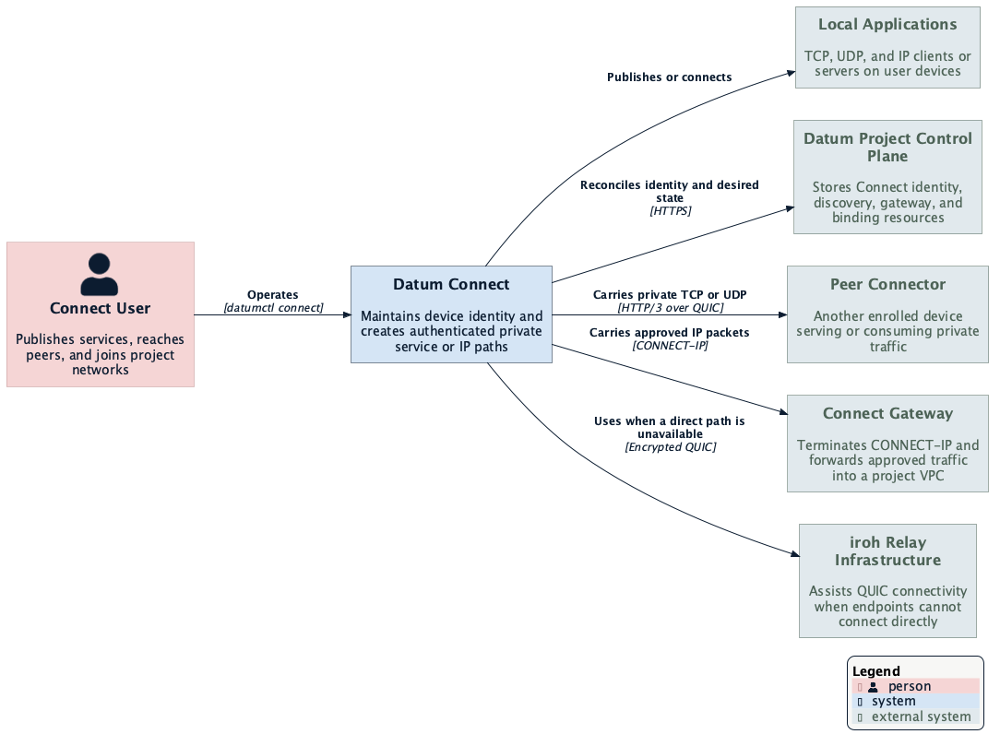
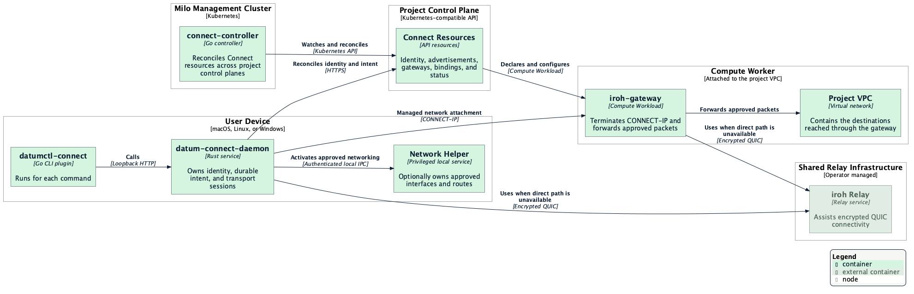

# Connect Service Architecture

Datum Connect lets a device publish a local TCP or UDP service, reach a service
on another Connector, or attach to an approved project network. A small CLI
plugin presents the user interface while a persistent local daemon owns device
identity, durable intent, transports, and local networking.

Connect is a preview. Device identity, service advertisements, and managed VPC
attachment use `connect.datumapis.com/v1alpha1`. Public ingress still uses the
NSO-owned HTTPProxy API. This documentation describes that split as it exists
today. Gateway sections describe the stable service contract and deliberately
leave runtime placement abstract so shared and dedicated capacity can evolve
without changing client behavior.

## How It Works

The `datumctl connect` plugin sends authenticated requests to a loopback-only
daemon. The daemon enrolls one Connector identity per project, reconciles cloud
resources, and keeps the data-plane endpoints alive. Depending on the command,
it then creates one of three paths:

- **Service publication**: `serve` forwards a private TCP or UDP service to
  approved Connectors, or requests an HTTPProxy for explicit public ingress.
- **Service dialing**: `dial` binds a loopback port and forwards connections or
  datagrams to a pinned Connector key and remote port.
- **Network attachment**: `join` establishes CONNECT-IP to a peer or managed
  gateway and installs only the address and routes approved for that attachment.

The control plane communicates desired state and authorization. Application
bytes and IP packets travel directly or through an iroh relay; they do not pass
through the Connect controller.

## System Context

The CLI is intentionally stateless. The daemon is the local control point and
persists desired state before applying it. The project API stores shared
identity, discovery, and attachment resources. The controller turns gateway
and binding resources into gateway service assignments and grants. A separate
privileged helper limits native interface changes to pre-approved plans.

## Deployment Topology

The user-facing plugin runs only for a command. The daemon persists on the user
device. The controller runs centrally in the Milo management cluster and
reconciles remote project APIs. The platform Connect Gateway service provides
isolated project network attachments using shared multi-tenant capacity by
default or dedicated single-tenant capacity when requested. Relays are shared
infrastructure outside the Connect controller deployment.

See [Deployment Topology](./deployment-topology.md) for the complete process
inventory, platform variants, privilege boundaries, and byte paths.

## Core Concepts

### Connector Identity

Each enrolled project has a Connector resource and an iroh public key. The
private key remains on the device. Names are for discovery and display; saved
allowlists and dials pin the resolved public key so name reuse cannot silently
redirect an existing grant.

### Desired and Observed State

The daemon stores project, service, dial, token, and managed-network intent in
a private versioned state file. A successful mutation is persisted atomically
before it becomes visible in memory. Reconciliation restores projects,
services, dials, and managed VPC attachments after restart. Direct-peer and
static CONNECT-IP attachments are deliberately ephemeral.

See [Enrollment and Reconciliation](./enrollment-and-reconciliation.md).

### Control Plane and Data Plane

Control-plane resources answer who a Connector is, what it advertises, and
which network it may join. The transport establishes authenticated HTTP/3
sessions between endpoint keys. TCP and UDP services use CONNECT requests;
network attachments carry complete IP packets in QUIC DATAGRAM frames.

### Fail-Closed Local Networking

The user daemon cannot ask the networking helper for arbitrary routes. The
helper stores an administrator-approved address, interface, MTU, and route set,
then accepts only an exact matching plan. Connect never changes a default
route, global forwarding, or the host firewall.

## Technology Stack

| Component | Technology | Purpose |
| --- | --- | --- |
| CLI plugin | Go, Cobra, `datumctl` plugin protocol | User workflow and loopback daemon client |
| Local daemon | Rust, Tokio, Axum | Durable intent, reconciliation, local API, and transports |
| Peer transport | iroh 1.0, QUIC, HTTP/3, MASQUE | Authenticated TCP, UDP, and IP forwarding |
| Network adapter | Rust with Linux TUN, macOS utun, or Wintun | Native packet delivery and exact routes |
| Network helper | Privileged Rust service | Applies only administrator-approved adapter plans |
| Connect controller | Go, controller-runtime, Milo multicluster runtime | Reconciles project resources, gateways, and bindings |
| Connect Gateway | Platform-managed shared or dedicated service | Terminates CONNECT-IP and forwards approved VPC traffic |

## API Resources

The Connect controller serves these resources under
`connect.datumapis.com/v1alpha1`:

| Resource | Scope | Description |
| --- | --- | --- |
| `ConnectorClass` | Cluster | Permitted transports and capabilities |
| `ConnectGatewayClass` | Cluster | Gateway controller, lifecycle policy, and operator implementation reference |
| `Connector` | Project | Device public identity, endpoint, relays, and readiness |
| `ConnectorAdvertisement` | Project | TCP and UDP services published by one Connector |
| `ConnectGateway` | Project | Desired managed gateway service and VPC attachment |
| `ConnectNetworkBinding` | Project | Approval for one Connector to attach to one gateway |

Public ingress still creates an NSO-owned
`networking.datumapis.com/v1alpha` HTTPProxy. Connector identity, peer
discovery, advertisements, gateways, and bindings are Connect-owned. There is
no conversion webhook or automatic copy from legacy Connector resources.

## Learn More

### Components

- [Client Device Architecture](../components/client-device-architecture.md) —
  complete device process model and platform boundaries
- [Daemon Architecture](../components/daemon-architecture.md) — loopback API,
  durable state, reconciliation, and transport runtime
- [Network Helper Architecture](../components/network-helper-architecture.md) —
  privileged approvals, adapter ownership, and packet IPC
- [Controller Architecture](../components/controller-architecture.md) —
  multicluster reconciliation and gateway provisioning
- [Connect Gateway Architecture](../components/gateway-architecture.md) —
  gateway identity, admission, CONNECT-IP, and VPC forwarding

### End-to-End Flows

- [Deployment Topology](./deployment-topology.md) — process placement,
  ownership, privilege, and network boundaries
- [Enrollment and Reconciliation](./enrollment-and-reconciliation.md) — local
  durable intent and cloud enrollment
- [Service Publication](./service-publication.md) — private and public service
  paths, allowlists, and dials
- [Managed VPC Attachment](./managed-vpc-attachment.md) — gateway and binding
  reconciliation
- [CONNECT-IP Data Plane](./connect-ip-data-plane.md) — packet path, policy,
  MTU, and recovery

### Cross-Cutting Concerns

- [Identity and Authorization](./identity-and-authorization.md) — credentials,
  keys, daemon roles, and approval boundaries
- [Resource Model](./resource-model.md) — API and local state ownership
- [Multi-Tenancy](./multi-tenancy.md) — project isolation and cross-scope rules
- [Observability](./observability.md) — logs, counters, traces, and diagnostics

## References

- [HTTP Semantics](https://www.rfc-editor.org/rfc/rfc9110)
- [HTTP/3](https://www.rfc-editor.org/rfc/rfc9114)
- [QUIC DATAGRAM](https://www.rfc-editor.org/rfc/rfc9221)
- [CONNECT-UDP](https://www.rfc-editor.org/rfc/rfc9298)
- [CONNECT-IP](https://www.rfc-editor.org/rfc/rfc9484)
- [iroh documentation](https://www.iroh.computer/docs)
