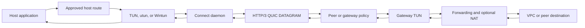

# CONNECT-IP Data Plane

CONNECT-IP carries an approved IPv4 or IPv6 overlay across an authenticated
HTTP/3 session. The client daemon bridges packets between a native adapter and
QUIC DATAGRAM frames. A peer daemon or managed gateway validates the session and
forwards only traffic allowed by its grant.

## Packet Path

The daemon and gateway exchange complete IP packets. There is no reliable
stream fallback, silent fragmentation, or automatic MTU reduction.

## Attachment Modes

| Mode | Configuration source | Lifetime |
| --- | --- | --- |
| Managed gateway | `ConnectNetworkBinding` status plus helper approval | Desired state persists and reconciles |
| Direct peer | Symmetric saved peer binding and explicit traffic rules | Session is ephemeral |
| Static gateway | Protected `--local-ip-config` file | Session is ephemeral |

Each attachment uses one overlay family. IPv4 assignments are `/32`; IPv6
assignments are `/128`; all routes for that attachment use the same family. The
underlay may use either family independently. Dual-stack attachments, IPv6
extension headers, and fragments are not supported.

## Admission and Policy

Transport identity is the iroh endpoint key. Before creating a native adapter,
the client verifies that the authenticated server grant matches the expected
address, routes, and MTU. The gateway admits only Connector keys present in its
current grant configuration.

Direct-peer bindings add explicit inbound and outbound TCP ports, UDP ports, or
ICMP echo rules. Membership alone grants no traffic. Subnet routing requires a
client route, matching router advertisement, and approved destination ports.
The client retains one approved source address, preventing arbitrary site-to-
site source spoofing.

## MTU and Datagrams

The approved MTU is between 1280 and 1500 bytes. Before adapter creation, the
transport checks that the current QUIC path can carry a complete IP packet plus
CONNECT-IP datagram framing. `effective_datagram_ip_capacity` reports the
observed packet capacity.

If capacity shrinks during a session, outgoing forwarding pauses for up to
three seconds while iroh probes alternate paths. Packets during the pause are
dropped and counted. If capacity remains below the approved MTU, the session
fails closed and the owned interface and routes are removed.

## Native Adapters

| Platform | Adapter | Ownership rule |
| --- | --- | --- |
| Linux | Nonpersistent TUN | Requires `/dev/net/tun` and `CAP_NET_ADMIN` |
| macOS | Kernel-assigned utun | Label is requested; kernel chooses `utunN` |
| Windows | Exclusive Wintun | Requires pinned official DLL and Administrator or LocalSystem |

Connect refuses to adopt an existing interface or replace an existing exact
route. Cancellation removes only state created by the current attachment. It
never modifies the default route, global forwarding, or firewall settings.

## Recovery and Cleanup

`leave`, `down`, lost authorization, terminal session failure, and daemon
shutdown cancel the attachment and close the adapter. Managed desired state is
retained across an unexpected daemon restart and reconciled later; the live
interface and session themselves never survive process exit. Direct and static
attachments must be joined again explicitly.

Rejected packets increment policy-drop counters without terminating an
otherwise healthy session. Transport protocol errors, an unusable MTU, or loss
of authorization close the session and remove local networking.

## Diagnostics

Client and gateway logs share a `session_id`. Ten-second `connect_ip_health`
snapshots expose packet and byte totals, datagrams, policy drops, last-packet
times, and transport errors. Compare the path in order:

1. local adapter to client transport;
2. client datagrams to gateway receipt;
3. gateway policy and TUN injection;
4. gateway forwarding or NAT;
5. VPC route, firewall, and destination response;
6. gateway return and client adapter delivery.

The counters locate the failing segment; they cannot identify a specific VPC
firewall or workload rule.

## Related Documentation

- [Managed VPC Attachment](./managed-vpc-attachment.md)
- [Network Helper Architecture](../components/network-helper-architecture.md)
- [Observability](./observability.md)
- [CONNECT-IP daemon guide](../../connect-lib/daemon/README.md)
