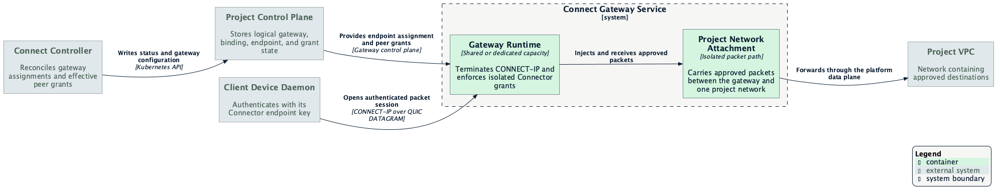

# Deployment Topology

Connect spans user devices, shared control-plane services, and a gateway data
plane. The logical contracts remain stable even when the platform changes
runtime placement.


## Process Placement

| Process | Placement | Lifetime and responsibility |
| --- | --- | --- |
| `datumctl-connect` | User shell or automation host | One command; user interaction and loopback daemon client |
| `datum-connectd` | User device | Persistent; identity, durable intent, reconciliation, listeners, and transports |
| Network helper | macOS or Linux device | Optional privileged service; approved interfaces and routes only |
| Windows daemon service | Windows device | Persistent protected service; daemon and native adapter ownership |
| Connect controller | Datum management plane | Persistent; reconciles project Connect resources and gateway assignments |
| Connect Gateway service | Platform gateway data plane | Terminates approved CONNECT-IP sessions and reaches one project network |
| iroh relay | Shared relay infrastructure | Assists encrypted QUIC reachability; provides no authorization |

## User Device

The CLI runs only long enough to express intent and show status. The daemon is a
per-user background service on macOS and Linux and exposes an authenticated
loopback API. It keeps sessions alive independently of a terminal.

TCP and UDP services require no elevated process. Network attachment introduces
the separately installed helper described in
[Trust and Ownership](trust-and-ownership.md). A system-wide or workload
deployment uses protected workload credentials rather than borrowing an
interactive user's session.

## Management and Project Control Planes

One controller can reconcile multiple project control planes while using a
project-scoped client for each tenant. Project APIs store desired and observed
resources; they do not host a per-project Connect server and do not carry user
traffic.

The controller is responsible for reconciliation, not packet forwarding. It
does not require native routing privileges. If a controller is unavailable,
existing data-plane sessions may continue until their own authorization or
transport lifecycle ends, while new or changed intent waits to converge.

## Connect Gateway Service



A `ConnectGateway` names a logical service and policy, not a Kubernetes pod or
dedicated process. The platform can satisfy that contract with shared
multi-tenant capacity or dedicated single-tenant capacity. Both expose the same:

- authenticated endpoint identity;
- Connector-scoped grants;
- approved client address and routes;
- readiness and applied-configuration status;
- isolated path to the selected project network.

This abstraction keeps scheduling, scaling, and physical network attachment out
of the client API. Shared placement is acceptable only when tenant policy,
packet paths, and telemetry remain isolated.

## Traffic Paths

### Private Service

```text
local client
  -> dialing device daemon
  -> direct or relay-assisted HTTP/3
  -> serving device daemon
  -> local service
```

### Managed Project Network

```text
host packet
  -> approved native adapter and device daemon
  -> direct or relay-assisted CONNECT-IP
  -> Connect Gateway service
  -> isolated project-network attachment
  -> approved VPC destination
```

In both paths, project APIs coordinate identity and policy but remain outside
the byte path. A relay may carry encrypted QUIC packets when a direct path is
unavailable; endpoint authentication and Connect policy still decide admission.

## Deployment-Dependent Capabilities

The architecture leaves these choices to the environment and later
implementation PRs:

- shared versus dedicated gateway capacity;
- exact gateway scheduling and scaling mechanism;
- relay locations and operating model;
- public-ingress placement;
- VPC forwarding, firewall, NAT, and return-route policy;
- supported native operating-system and network combinations.

Those choices must not weaken the product-level identity, project isolation,
or fail-closed local networking contracts.
