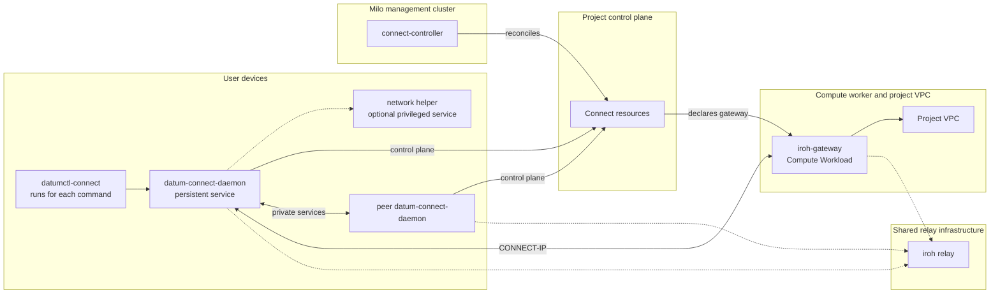

# Deployment Topology

Connect is not one service process. It is a set of host, control-plane, and
data-plane processes deployed in different trust and network boundaries. This
document shows where each process runs and which team or user operates it.

## Deployment at a Glance



The plugin and daemon run on each user device. The controller runs once in the
Milo management cluster. Project resources live in the project control plane,
and each managed gateway runs as a Compute Workload attached to that project's
VPC. Dotted arrows are optional relay-assisted paths. The controller and project
API never carry application bytes or IP packets.

## Process Inventory

| Process | Runs in | Lifetime | Privilege and responsibility |
| --- | --- | --- | --- |
| `datumctl` | User shell or automation host | One CLI invocation | Selects login and project context, then launches the plugin |
| `datumctl-connect` | Same user host as `datumctl` | One plugin invocation | Stateless UX, installation workflow, and loopback daemon client |
| `datum-connect-daemon` | User device | Persistent background service | Owns cloud authorization, Connector keys, durable intent, listeners, transports, and sessions |
| `datum-connect-network-helper` | macOS or Linux user device | Persistent root service when CONNECT-IP is enabled | Owns only approved adapters, routes, and packet IPC; has no cloud credentials or Connector key |
| Windows `datum-connect-daemon` | Windows device | Persistent LocalSystem service | Owns daemon responsibilities and Wintun because Windows does not use the Unix helper model |
| `connect-controller` | Milo management cluster | Persistent Kubernetes Deployment with leader election | Discovers projects and reconciles Connect resources, gateway configuration, and Compute Workloads |
| `iroh-gateway` | Compute Workload on a VPC-attached worker | Persistent per managed `ConnectGateway` | Authenticates CONNECT-IP clients and forwards approved packets between its TUN and the VPC |
| iroh relay | Operator-managed relay infrastructure | Persistent shared service | Assists QUIC reachability; does not authorize a Connector or inspect Connect control-plane intent |
| MASQUE-capable ingress edge | Deployment-specific ingress infrastructure | Persistent when public ingress is offered | Reaches explicitly public services as an approved gateway identity; not deployed by `connect-controller` |

## User Device

### macOS and Linux

The plugin is executed by `datumctl` for each command and exits after printing
the result. A per-user launchd or systemd service keeps
`datum-connect-daemon` running independently of the terminal. Its loopback API
defaults to `127.0.0.1:47780` and requires a daemon bearer token for all project
operations.

Ordinary `serve` and `dial` need no elevated process. When CONNECT-IP is enabled,
the separately installed root helper owns native interfaces and exact routes.
The user daemon retains the Datum session and Connector private keys. The two
processes communicate over authenticated local IPC and exchange framed packets,
not arbitrary privileged commands.

An explicitly configured system daemon is also possible, but it must use a
credential file rather than a user's interactive OIDC session. Do not run user
and system daemons on the same API port.

### Windows

Windows runs the daemon as a native Service Control Manager service, normally
under LocalSystem, with protected service state and credential-file
authentication. The daemon loads the pinned Wintun driver and owns the adapter
in-process. Interactive host-session OIDC and the Unix helper topology do not
apply.

## Management Plane

`connect-controller` runs as a Kubernetes Deployment in the Milo management
cluster. Leader election ensures one active reconciler. The process uses Milo's
multicluster runtime to watch Project and ProjectControlPlane discovery, reads
cluster-scoped ConnectorClass configuration, and obtains clients for project
control planes.

The controller container runs non-root with a read-only root filesystem. Its
metrics endpoint is on port 8080 and health probes use port 8081. These ports are
cluster-operational endpoints and are unrelated to the Connect data plane.

## Project Control Plane

Each project control plane stores the desired and observed resources for that
tenant. It does not run a per-project Connect server process. The shared
controller watches these remote APIs and reconciles:

- Connector identity and its 30-second Lease;
- service advertisements;
- managed gateway intent and gateway Secret/ConfigMap;
- Connector-to-gateway bindings and their derived addresses and routes;
- the Compute Workload resource for the gateway;
- optional NSO HTTPProxy resources created by the device daemon for public
  ingress.

This API traffic is control-plane traffic only. Private service connections and
CONNECT-IP packets do not traverse the project API server.

## Compute and VPC Data Plane

Every managed ConnectGateway becomes a one-replica Compute Workload. The
Workload runs the externally built `iroh-gateway` executable on a worker with an
interface in the requested project Network. The gateway receives its private
identity from a mounted Secret and its exact peer grants from a mounted or
rendered ConfigMap.

Inside the Workload, the process terminates authenticated CONNECT-IP sessions,
applies grant and packet policy, and exchanges packets with a TUN. The worker
routes approved traffic between that TUN and the VPC interface. The Workload
needs `NET_ADMIN`, `MKNOD`, and forwarding sysctls; the controller itself does
not.

Gateway Prometheus metrics bind to `127.0.0.1:9090` inside the Workload. They are
not exposed on the VPC interface by the controller.

## Relay Infrastructure

Direct peer and gateway QUIC paths are preferred when reachable. An iroh relay
provides rendezvous and relay-assisted reachability when the endpoints cannot
connect directly. Relay processes run outside the user device, project control
plane, and Connect controller deployment.

The daemon selects Datum staging relays for the pinned staging API environment,
uses iroh presets elsewhere, or accepts an explicit override. The relay can
carry encrypted transport packets but is not an authorization source; endpoint
keys and Connect policy still decide admission.

## Optional Public Ingress

Public `serve` creates both a Connect ConnectorAdvertisement and an NSO
HTTPProxy. The HTTPProxy is consumed by separately deployed ingress
infrastructure. That edge must be registered as an approved Connector identity
in the ConnectorClass and use the compatible transport profile to reach the
serving daemon.

The reusable standards-facing MASQUE edge implementation in this repository is
not the same process as the managed `iroh-gateway` Workload. The Connect
controller currently deploys only the managed CONNECT-IP gateway. Production
placement and operation of the public edge remain platform deployment concerns.

## Common Deployment Paths

### Private Service

```text
client application
  -> client device daemon
  -> direct or relay-assisted HTTP/3
  -> serving device daemon
  -> local application
```

Only the two device daemons and an optional relay are in the byte path. The
controller and project API are used for identity, discovery, and policy refresh.

### Managed VPC Attachment

```text
host packet
  -> local adapter and device daemon
  -> direct or relay-assisted CONNECT-IP
  -> iroh-gateway Compute Workload
  -> gateway TUN and VPC interface
  -> VPC destination
```

The controller and project API prepare the binding and gateway grant but are
not in the packet path.

## Related Documentation

- [Architecture Overview](./README.md)
- [Managed VPC Attachment](./managed-vpc-attachment.md)
- [CONNECT-IP Data Plane](./connect-ip-data-plane.md)
- [Daemon Architecture](../components/daemon-architecture.md)
- [Controller Architecture](../components/controller-architecture.md)
- [Network Helper Architecture](../components/network-helper-architecture.md)
