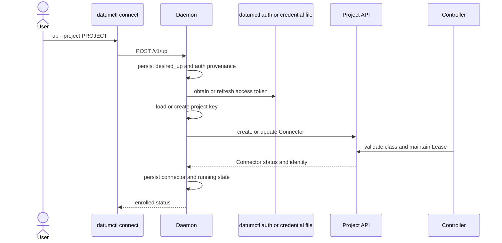

# Enrollment and Reconciliation

Enrollment binds a local, device-held transport key to a Connector resource in
one project. Reconciliation turns saved user intent into running endpoints and
cloud resources without treating transient runtime state as durable truth.

## Design Goals

- Keep private Connector keys and reusable credentials off the project API.
- Make `up`, `serve`, `dial`, `join`, `leave`, and `down` idempotent.
- Persist desired state before reporting a mutation as successful.
- Resume safe durable intent after process or host restart.
- Fail visibly when authorization, readiness, or local approval is missing.

## Enrollment Flow

Interactive macOS and Linux setup stores a secret-free reference to the current
`datumctl` session and asks `datumctl auth get-token` when authorization must be
refreshed. Credential-file mode imports a validated, refreshable credential
into daemon-owned private storage. Windows system services require file-based
credentials.

The daemon creates a hostname-derived Connector name unless the user selects
one. Existing Connector names and keys remain stable. A name collision requires
an explicit alternative; Connect does not adopt another device's identity.

## Readiness

The controller accepts a Connector only when its public key is a valid 32-byte
hex value and the referenced ConnectorClass permits `masque-v1`. It creates a
30-second project Lease and reports the Connector Ready only while the agent
renews that Lease. Ready therefore means that the enrolled agent is live enough
to renew its control-plane presence, not that every advertised service or
packet path has been tested.

## Durable State

The daemon keeps one versioned state document containing:

- per-project desired and observed enrollment state;
- the Connector name, UID, and public key;
- authentication provenance and imported credential location;
- service and dial intent;
- managed-network attachment intent;
- delegated daemon tokens and a bounded local audit trail.

Writes use a copy-on-write transaction. The replacement state file is written
with private permissions, flushed, atomically renamed, and the parent directory
is synchronized on Unix. Only then does the daemon publish the new in-memory
state. A process lock prevents two daemons from opening the same repository.

## Restart Reconciliation

At startup the daemon resets runtime-only fields and periodically reconciles
projects whose `desired_up` flag is set. A successful project resume recreates:

1. cloud authorization and the local transport endpoint;
2. saved services whose `desired_active` flag is set;
3. saved dials whose `desired_active` flag is set;
4. managed network attachments whose `desired_attached` flag is set.

The reconciler records the stage and last error instead of erasing intent.
Retryable resume failures are retried with backoff. Commands remain idempotent:
repeating an equivalent mutation returns the existing object, while a
conflicting mutation requires the old intent to be removed first.

> [!IMPORTANT]
>
> Direct-peer and static `--local-ip-config` attachments do not reconnect after
> restart. Only controller-managed VPC attachments are durable attachment
> intent, and the helper's exact approval remains authoritative.

## Shutdown and Removal

`down` clears running project state and closes services, dials, and attachments.
It does not silently delete the user's saved configuration. A later interactive
`serve` can ask whether to restore it. `leave` clears one managed attachment's
intent and removes its `ConnectNetworkBinding`; repeating `leave` is safe.

## Failure Boundaries

| Failure | Result |
| --- | --- |
| Access token cannot refresh | Project remains desired but not running; stage is recorded |
| Connector class is invalid | Connector is not Ready; dependent advertisements and bindings do not become usable |
| State replacement fails | Mutation is not published in memory |
| Cloud status update conflicts | Client retries using the latest resource version and ownership checks |
| Relay is not ready within 15 seconds | Enrollment fails before publishing an unusable endpoint |
| Local networking approval is missing or stale | Attachment remains desired but no interface is created |

## Related Documentation

- [Architecture Overview](./README.md)
- [Identity and Authorization](./identity-and-authorization.md)
- [Resource Model](./resource-model.md)
- [Daemon Architecture](../components/daemon-architecture.md)
