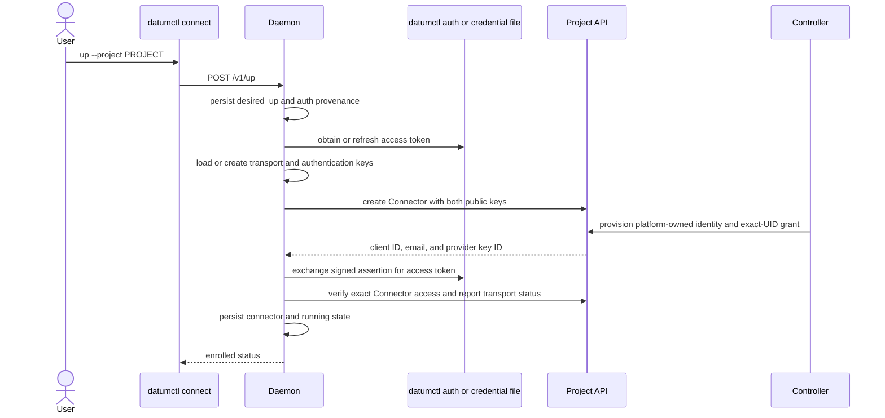

# Enrollment and Reconciliation

Enrollment binds two local, device-held keys to one Connector resource in one
project: an iroh key for peer transport and a distinct RSA key for
control-plane authentication. Reconciliation turns saved user intent into
running endpoints and cloud resources without treating transient runtime state
as durable truth.

## Design Goals

- Keep private Connector keys and reusable credentials off the project API.
- Create both Connector identities atomically so no partially enrolled identity
  can be adopted later.
- Make `up`, `serve`, `dial`, `join`, `leave`, and `down` idempotent.
- Persist desired state before reporting a mutation as successful.
- Resume safe durable intent after process or host restart.
- Fail visibly when authorization, readiness, or local approval is missing.

## Enrollment Flow

Interactive macOS and Linux setup stores a secret-free reference to the current
`datumctl` session and asks `datumctl auth get-token` when authorization must be
refreshed. Credential-file mode imports a validated, refreshable credential
into daemon-owned private storage. Windows system services require file-based
credentials.

For a supported Datum origin, the interactive session is bootstrap authority,
not the long-lived Connector credential. The daemon persists both private keys
before creation, waits for the platform-owned service account and its key to be
ready, exchanges an RSA-signed assertion, and verifies that the resulting token
can read the exact Connector. Only then does it replace the bootstrap session
with the per-Connector credential. A failed or interrupted enrollment reuses
the pending keys on retry.

The daemon creates a hostname-derived Connector name unless the user selects
one. Existing Connector names and keys remain stable. A name collision requires
an explicit alternative; Connect does not adopt another device's identity.

## Readiness

The controller accepts a Connector only when its transport public key is a
valid 32-byte hex value, its authentication public key is a supported RSA PEM,
and the referenced ConnectorClass permits `masque-v1` and advertises
`connector-authentication`. Both public keys are immutable. The controller
reports authentication readiness only after the service account exposes its
provider client ID and email and the registered key exposes its provider key
ID. It reports Connector readiness only while the agent renews its 30-second
project Lease. Ready therefore means that identity provisioning completed and
the enrolled agent is live enough to renew its control-plane presence, not that
every advertised service or packet path has been tested.

## Durable State

The daemon keeps one versioned state document containing:

- per-project desired and observed enrollment state;
- the Connector name and UID plus both public identities;
- references to both private keys and the provider-issued credential fields in
  protected daemon storage;
- authentication provenance and imported credential location;
- service and dial intent;
- managed-network attachment intent;
- delegated daemon tokens and a bounded local audit trail.

Writes use a copy-on-write transaction. The replacement state file is written
with private permissions, flushed, atomically renamed, and the parent directory
is synchronized on Unix. Only then does the daemon publish the new in-memory
state. A process lock prevents two daemons from opening the same repository.

## Restart Reconciliation

At startup the daemon resets runtime-only fields and periodically reconciles
projects whose `desired_up` flag is set. A successful project resume recreates:

1. cloud authorization and the local transport endpoint;
2. saved services whose `desired_active` flag is set;
3. saved dials whose `desired_active` flag is set;
4. managed network attachments whose `desired_attached` flag is set.

The reconciler records the stage and last error instead of erasing intent.
Retryable resume failures are retried with backoff. Commands remain idempotent:
repeating an equivalent mutation returns the existing object, while a
conflicting mutation requires the old intent to be removed first.

> [!IMPORTANT]
>
> Direct-peer and static `--local-ip-config` attachments do not reconnect after
> restart. Only controller-managed VPC attachments are durable attachment
> intent, and the helper's exact approval remains authoritative.

## Shutdown and Removal

`down` clears running project state and closes services, dials, and attachments.
It does not silently delete the user's saved configuration. A later interactive
`serve` can ask whether to restore it. `leave` clears one managed attachment's
intent and removes its `ConnectNetworkBinding`; repeating `leave` is safe.

## Failure Boundaries

| Failure | Result |
| --- | --- |
| Access token cannot refresh | Project remains desired but not running; stage is recorded |
| Platform identity is not ready | Enrollment retains its bootstrap authority and pending keys for retry |
| Connector class is invalid | Connector is not Ready; dependent advertisements and bindings do not become usable |
| State replacement fails | Mutation is not published in memory |
| Cloud status update conflicts | Client retries from the latest resource version without replacing controller-owned authentication or conditions |
| Relay is not ready within 15 seconds | Enrollment fails before publishing an unusable endpoint |
| Local networking approval is missing or stale | Attachment remains desired but no interface is created |

## Related Documentation

- [Architecture Overview](./README.md)
- [Identity and Authorization](./identity-and-authorization.md)
- [Resource Model](./resource-model.md)
- [Daemon Architecture](../components/daemon-architecture.md)
