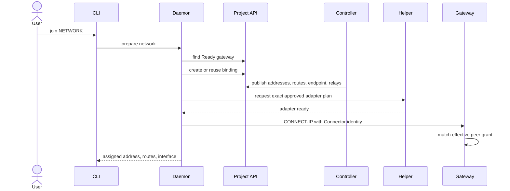

# Managed VPC Attachment

A managed attachment connects one project Connector to an operator-managed
gateway in the same project's VPC. The project API is the authorization and
coordination surface; the controller assigns gateway service capacity and
derives the exact client grant consumed by the daemon.

## Resource Flow

```mermaid
flowchart TD
    class[ConnectorClass]
    connector[Connector]
    lease[Lease]
    gateway[ConnectGateway]
    service[Connect Gateway service]
    grants[Effective grants]
    network[NSO Network]
    binding[ConnectNetworkBinding]
    daemon[Connector daemon]

    connector --> class
    connector --> lease
    gateway -->|logical assignment| service
    service -->|isolated attachment| network
    binding --> connector
    binding --> gateway
    binding --> grants
    grants --> service
    daemon -->|create, read, delete| binding
    daemon -->|CONNECT-IP| service
```

## Gateway Reconciliation

`ConnectGateway` names a Network and declares the gateway policy and approved
routes. The controller:

1. validates routes, relay policy, placement requirements, and references;
2. assigns compatible gateway capacity according to platform policy; the target
   model defaults to shared multi-tenant capacity and can honor a dedicated
   single-tenant request when offered;
3. establishes an isolated attachment to the requested Network;
4. applies the gateway endpoint identity and approved peer grants;
5. publishes the public endpoint ID and assignment status; and
6. reports Ready when the endpoint, network attachment, and configuration are
   available.

The service's runtime placement and process count are not part of the resource
contract. Gateway Ready proves service and attachment availability; it does not
prove that any client is attached or that packets can reach a destination
inside the VPC.

## Binding Reconciliation

`ConnectNetworkBinding` names one Connector and one ConnectGateway. Permission
to create that project resource is the primary approval boundary. The controller
requires both references to be valid and ready, then derives deterministic,
matching IPv6 `/128` addresses for the client and gateway.

Binding status contains:

- the gateway endpoint ID;
- the client assigned `/128` and gateway peer `/128`;
- approved VPC and optional peer routes;
- the relay URLs selected for the gateway;
- readiness conditions and observed generation.

The same values are applied to the assigned gateway service. A binding is not
Ready until the service has observed a configuration that includes the
Connector. Deleting the binding removes the grant during reconciliation.

## Join Flow



The daemon persists managed attachment intent. On restart it recreates the
binding and session after project enrollment resumes. The privileged helper is
still authoritative: if the controller returns a new address or route set, the
join fails with `approval_required` until an administrator approves the
replacement.

## Peer Routing

`spec.peerRouting` is disabled by default. When enabled, the controller adds
every other Ready binding's assigned `/128` to each grant, subject to the
32-route limit. The gateway may then forward traffic between authenticated
sessions without sending it through the VPC or its NAT path.

Peer routing is not general transit. Each client still has one assigned source
address, a bounded route set, and an authenticated grant. It does not authorize
arbitrary source prefixes or change host firewall policy.

## Failure and Recovery

| Condition | Behavior |
| --- | --- |
| Assigned gateway capacity unavailable | Gateway and dependent bindings remain not Ready |
| Connector Lease expires | Connector is not Ready; new admission fails |
| Grant absent from applied configuration | Binding waits and gateway rejects the session |
| Route capacity exceeds 32 | Reconciliation reports an explicit capacity error |
| Helper approval differs | No local interface is created until explicit replacement approval |
| Session or daemon stops | Runtime interface is removed; durable managed intent is retried |
| Binding is deleted | Controller removes the gateway grant; daemon `leave` clears local intent |

## Current Limitations

- The managed path currently requires IPv6 `/128` client and gateway addresses.
- Gateway-to-instance packet forwarding must be validated on each target native
  environment.
- Gateway image, relay network, and daemon transport profile must match.
- Identity rotation and full deletion lifecycle are not production-ready.
- Gateway operators remain responsible for VPC forwarding, firewall rules, and
  source NAT or return routes.

## Related Documentation

- [Architecture Overview](./README.md)
- [CONNECT-IP Data Plane](./connect-ip-data-plane.md)
- [Controller Architecture](../components/controller-architecture.md)
- [Connect API and controller](../../connect-controller/README.md)
