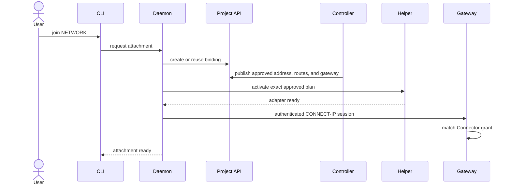

# Product Workflows

The CLI expresses intent; the daemon owns the resulting runtime. Each workflow
uses the project control plane for coordination and an authenticated transport
for user traffic.

## Enroll a Connector

Before a device can publish, dial, or join, the daemon establishes one
Connector identity in the selected project:

1. `datumctl` supplies the selected project and an authorized user or workload
   session.
2. The plugin asks the loopback daemon to enroll.
3. The daemon creates or verifies its Connector resource and publishes only the
   public transport identity and reachability information.
4. The daemon keeps the private key locally and refreshes readiness while the
   project is active.

Enrollment authorizes the device to participate. It does not, by itself, grant
access to a service or network.

## Publish a Service

Publishing turns a local TCP or UDP endpoint into durable service intent.

```text
local application
  <- local TCP or UDP -> serving daemon
  <- authenticated HTTP/3 -> dialing Connector
```

The daemon validates that the destination is local, resolves any named
allowlist to Connector keys, persists the intent, and advertises the service in
the project. It accepts only the declared protocol and destination.

Private access is the default. With no explicit allowlist, the initial product
may define a project-scoped default policy, but gateway identities remain
excluded unless the publisher intentionally grants one. Public HTTP exposure is
a separate explicit action and depends on compatible ingress infrastructure.

## Dial a Service

Dialing creates a loopback listener for a service on another Connector:

1. Resolve the remote Connector name in the selected project.
2. Persist the resolved public key with the desired protocol and port.
3. Bind a loopback-only local port.
4. Establish an authenticated HTTP/3 path directly or through an allowed
   relay.
5. Forward TCP streams or UDP datagrams while preserving their semantics.

The stored key, not the display name, controls the destination. Retargeting a
dial therefore requires an explicit user action.

## Join a Project Network

Joining a managed network coordinates cloud authorization, transport
admission, and a local privileged change:



Permission to create or reuse the project binding is the cloud approval. The
controller derives the endpoint, client address, routes, and effective gateway
grant. The helper remains authoritative for local changes: a new or expanded
plan must fit an administrator-approved policy or receive explicit approval.

The managed attachment is durable intent and can be reconciled after restart.
Its live interface and CONNECT-IP session are disposable and are removed when
the attachment loses authorization or stops.

## Control Plane and Data Plane

| Concern | Control plane | Data plane |
| --- | --- | --- |
| Device identity | Connector resource and readiness | Authenticated endpoint key |
| Service discovery | Connector advertisement | HTTP/3 CONNECT or CONNECT-UDP |
| Network access | Gateway and binding resources | CONNECT-IP over QUIC DATAGRAM |
| Reachability | Endpoint and relay metadata | Direct or encrypted relay-assisted QUIC |
| Local networking | Approved adapter plan | Native interface packet exchange |

The controller and project API never carry application payloads or IP packets.
Relays may carry encrypted transport traffic but cannot create a grant or
change the expected endpoint identity.

## Failure and Recovery

Connect fails closed when layers disagree:

- a missing or stale cloud grant prevents admission;
- an unexpected endpoint key prevents connection;
- a route or address outside local approval prevents interface creation;
- an unusable packet size closes the CONNECT-IP path rather than silently
  fragmenting or rerouting traffic;
- removing local intent closes the runtime path before remote cleanup is
  attempted.

Status should distinguish desired state, observed readiness, and the stage of
the last reconciliation error. Closing the terminal does not stop a durable
service, dial, or managed attachment because the daemon—not the CLI—owns it.

## Product Non-Goals

- A general-purpose project resource management CLI.
- Automatic public exposure of private services.
- Implicit cross-project discovery or routing.
- Arbitrary host route, firewall, forwarding, or NAT administration.
- Unrestricted site-to-site transit from a device attachment.
