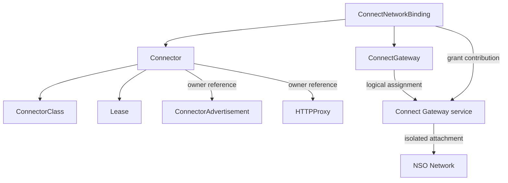

# Resource Model

Connect divides state between a project control plane, one local daemon
repository, and live process memory. Each location has a distinct owner and
recovery role.

## Control-Plane Resources

| Resource | Scope | Desired state | Important status |
| --- | --- | --- | --- |
| `ConnectorClass` | Cluster | Allowed transports and capabilities | Valid configuration and Ready |
| `Connector` | Project | Class, public key, endpoint, relay URLs | Ready, assigned addresses, Lease reference |
| `ConnectorAdvertisement` | Project | Connector reference and TCP/UDP ports | Accepted/Ready conditions |
| `ConnectGateway` | Project | Network, routes, gateway policy, peer routing | Service assignment, endpoint ID, Ready |
| `ConnectNetworkBinding` | Project | Connector and gateway references | Assigned and peer addresses, routes, relays, Ready |
| `Lease` | Project | Connector liveness record | Renew time |
| `HTTPProxy` | Project, NSO API | Explicit public hostname and backend | Ingress acceptance and hostnames |
| `Network` | Project, NSO API | VPC selected by name | Consumed through an isolated gateway attachment |

All Connect resources except ConnectorClass carry Milo's Project parent-context
annotation. ConnectorClass is management-cluster configuration because the
platform, not a project device, defines supported transport profiles.

## Ownership Graph

The Connect API owns the logical gateway assignment and grant relationship, not
the gateway service's deployment objects. Secrets, configuration objects,
processes, and scheduling resources used by a particular runtime are internal
to that platform implementation and are not part of the client contract.

Daemon-created child resources carry an owner label and a Connector owner
reference. Before reuse or deletion, the client checks both the label and owner
UID. Existing foreign resources and incompatible administrator edits are not
adopted or overwritten.

## Local Durable State

The daemon's versioned state is organized by project:

| State | Desired fields | Observed fields |
| --- | --- | --- |
| Project | device name, `desired_up`, auth source | running, enrolled, Connector identity, last error |
| Service | endpoint, protocol, public/hostname, pinned allowlist, `desired_active` | running, ready, hostnames, last error |
| Dial | pinned key, remote port, requested bind, protocol, `desired_active` | actual local port, running, last error |
| Managed network | network and `desired_attached` | running, lifecycle state, last error stage |
| Peer network | approved peer, address, routes, traffic rules | no durable reconnect instruction |
| Token | role, project/scopes, salted secret hash, expiry/revocation | audit use only |
| Audit | timestamp, event, project, resource, actor | bounded to the latest 500 entries |

Observed runtime flags are reset during process startup. Desired flags survive
and drive reconciliation. Private keys and credentials live in protected files
beside the state document rather than inside Kubernetes resources.

## Live Runtime State

For each running project, memory holds the current cloud client, iroh endpoint,
transport policy, active services, loopback dials, network attachments,
cancellation tokens, and refresh tasks. This state is disposable. The daemon
reconstructs it from durable intent plus current control-plane status.

## Consistency Model

Local mutations are serialized through a mutation lock and atomically persisted
before activation. Cloud resources are eventually consistent and reconciled
with deterministic names. Create conflicts are followed by a read; resource
version and ownership checks prevent uncertain requests from producing silent
adoption or destructive overwrite.

Status deliberately presents both desired and observed state. For example, a
managed network may be `desired_attached: true` but `running: false` with an
`approval_required` error. That is a recoverable convergence state, not missing
intent.

## Deletion Semantics

- Deleting a service removes both its ConnectorAdvertisement and any HTTPProxy
  after verifying ownership.
- Deleting a ConnectNetworkBinding removes the gateway grant on reconciliation.
- Deleting a Connector revokes refresh; the daemon does not recreate it during
  routine liveness refresh.
- `leave` closes the local path before attempting remote deletion, so deletion
  failure cannot leave traffic flowing contrary to local intent.
- Key rotation currently requires resource replacement rather than in-place
  mutation.

## Related Documentation

- [Architecture Overview](./README.md)
- [Enrollment and Reconciliation](./enrollment-and-reconciliation.md)
- [Managed VPC Attachment](./managed-vpc-attachment.md)
- [Controller Architecture](../components/controller-architecture.md)
