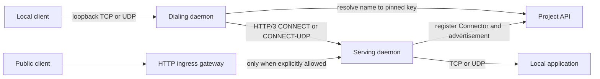

# Service Publication

Service publication exposes a local TCP or UDP endpoint through an enrolled
Connector. Services are private by default. Public HTTP ingress is a separate,
explicit request that depends on a compatible gateway and control plane.

## Overview

## Publishing a Service

`datumctl connect serve HOST:PORT` sends a service intent to the local daemon.
The daemon validates that the endpoint is local, resolves every requested
Connector name to a public key, persists the pinned allowlist, and asks the
project control plane to publish the service. The runtime then accepts only the
declared protocol and destination.

The saved service records the endpoint, protocol, public flag, optional
hostname, pinned allowlist, desired-active state, runtime readiness, published
hostnames, and the last reconciliation error.

### Private Access

Private is the default. With no explicit `--allow`, access includes project
devices and excludes gateway identities identified by the Connector's class and
aliases. An explicit `--allow` narrows the service to the resolved Connector
keys. Explicitly allowing a gateway can make the service reachable through that
gateway, so it is a security-sensitive choice.

### Public Access

`serve --public` requests an HTTPProxy and optional hostname. Public ingress is
not inferred from an empty allowlist and is never enabled by a plain `serve`.
It succeeds only when the environment has a gateway and control plane that
support the same transport profile.

## Dialing a Service

`datumctl connect dial CONNECTOR:PORT --bind LOCALPORT` creates the inverse
path. The daemon resolves the Connector name once, stores both its display name
and public key, and binds only a loopback listener. TCP accepts independent
connections; UDP maintains datagram associations. A bind value of zero lets the
operating system choose an available local port.

Name reuse cannot retarget an existing dial because authorization uses the
pinned key. To select a different device, the user removes and recreates the
dial explicitly.

## Transport Contracts

| Local service | Remote transport | Behavior |
| --- | --- | --- |
| TCP | HTTP/3 CONNECT | One bidirectional stream per connection |
| UDP | CONNECT-UDP over HTTP/3 datagrams | Datagram association with UDP boundaries preserved |
| Public HTTP | Gateway ingress plus service transport | Created only by explicit `--public` intent |

The iroh endpoint may connect directly or through an allowed relay. Relay
selection changes reachability, not the authenticated endpoint identity.

## Lifecycle and Recovery

Services and dials are durable intent. `pause` or `hangup` closes the runtime
path while preserving or removing intent according to the command. On daemon
restart, active intent is reconciled after the project resumes. Failures leave
the intent present with `last_error` and `last_error_stage` for status output.

The CLI does not own the listener or transport, so closing the terminal that
ran `serve` or `dial` does not stop the service. The persistent daemon owns the
runtime until the corresponding removal command or project shutdown.

## Migration Boundary

Connector enrollment, peer discovery, and service advertisements use Connect
`Connector` and `ConnectorAdvertisement` resources. Explicit public ingress
also creates an NSO-owned `networking.datumapis.com/v1alpha` HTTPProxy. The
HTTPProxy is owned by the Connect Connector UID so cleanup cannot delete another
device's object. Both API groups remain dependencies until public ingress moves
to a Connect-owned contract.

## Related Documentation

- [Architecture Overview](./README.md)
- [Identity and Authorization](./identity-and-authorization.md)
- [Enrollment and Reconciliation](./enrollment-and-reconciliation.md)
- [Daemon Architecture](../components/daemon-architecture.md)
