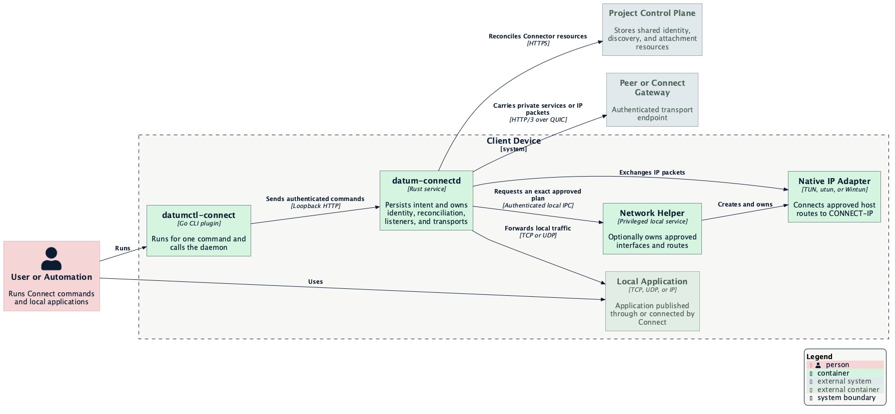

# Client Device Architecture

The client device is the user-facing edge of Connect. It turns short-lived CLI
commands into durable local intent, maintains the Connector's authenticated
transport endpoint, and exposes local applications or approved IP routes without
requiring a terminal to remain open.

This document describes the complete device boundary. The
[daemon architecture](./daemon-architecture.md) and
[network-helper architecture](./network-helper-architecture.md) cover the two
long-running processes in greater detail.

## Overview

`datumctl-connect` runs only for the duration of a command. The daemon persists
independently as the device's local control plane. The helper is installed only
when native CONNECT-IP networking requires elevated interface and route access.

## Processes

| Process | Lifetime | Responsibility |
| --- | --- | --- |
| `datumctl` | One command | Supplies login and project context and invokes the plugin |
| `datumctl-connect` | One command | Presents the UX, validates command input, and calls the daemon API |
| `datum-connectd` | Persistent service | Owns identity, authorization, desired state, reconciliation, listeners, and transports |
| `datum-connect-network-helper` | Optional persistent root service on macOS/Linux | Owns only pre-approved native interfaces, routes, and packet IPC |
| Windows daemon and Wintun | Persistent LocalSystem service | Combines daemon operation and native adapter ownership on Windows |

Local applications are not Connect processes. They remain ordinary TCP, UDP,
or IP clients and servers connected to loopback listeners, configured service
endpoints, or operating-system routes.

## Command Boundary

The plugin is intentionally stateless. It discovers or installs the local
service, reads the appropriate daemon token, sends one authenticated request to
the loopback API, formats the result, and exits. It does not retain listeners,
transport sessions, or cloud resources.

The daemon client accepts only `localhost` or literal loopback addresses and
does not follow redirects. The default endpoint is `127.0.0.1:47780`. Bearer
tokens distinguish setup, project operation, and read-only access.

This separation means closing a terminal does not stop a published service,
dial, or managed network attachment. The corresponding removal command changes
the daemon's durable intent.

## Persistent Daemon

The daemon is the device's authority for:

- one Connector identity and cloud authorization context per project;
- atomic private storage of project, service, dial, and managed-network intent;
- enrollment and Connector Lease renewal;
- private service policy and exact local targets;
- loopback TCP listeners and UDP associations for dials;
- direct, relayed, and managed-gateway transport sessions;
- CONNECT-IP session lifecycle and packet diagnostics;
- restart reconciliation and fail-closed authorization refresh.

Each running project has a separate cloud client, iroh endpoint, Connector key,
transport policy, and cancellation tree. Project membership or policy in one
runtime does not authorize another runtime on the same host.

## Application Connectivity

### Publishing

For `serve`, the daemon accepts authenticated HTTP/3 CONNECT or CONNECT-UDP
requests and forwards them to one configured local TCP or UDP endpoint. The
requesting peer's endpoint key must match the service policy.

### Dialing

For `dial`, the daemon binds a loopback TCP listener or UDP socket. Local
application traffic causes the daemon to open a session to the saved, pinned
Connector key and remote port.

### Network Attachment

For `join`, the daemon establishes CONNECT-IP with an approved peer or managed
gateway and bridges packets to a native interface. Managed gateway intent is
durable. Direct-peer and static attachments are recreated only by an explicit
join.

## Privilege Boundary

Ordinary service publication and dialing run entirely as the user. They do not
install a helper or modify host networking.

On macOS and Linux, CONNECT-IP can use a separate root helper. The helper has no
Datum credentials or Connector private key. It accepts only the configured user
daemon and an exact administrator-approved interface, address, peer, MTU, and
route set. Closing the authenticated IPC session removes the helper-owned
interface and routes.

Windows uses a LocalSystem daemon and a pinned Wintun driver instead of the Unix
helper model. Protected ACLs and credential-file authentication replace the
interactive user-session workflow.

## State and Files

The device stores three kinds of information separately:

| State | Owner | Persistence |
| --- | --- | --- |
| Desired Connect state and delegated token hashes | Daemon repository | Durable and atomically replaced |
| Project Connector private keys and imported credentials | Daemon private files | Durable and never published to the project API |
| Live endpoints, listeners, associations, and interfaces | Daemon or helper memory/kernel state | Reconstructed or removed after process exit |

A process lock prevents two daemons from owning one repository. Unsupported
state versions and unsafe file permissions fail startup instead of being
silently repaired into an unknown security state.

## Platform Deployment

| Platform | Default deployment |
| --- | --- |
| macOS | Per-user launchd daemon; optional root network helper; kernel-assigned utun |
| Linux | Per-user systemd daemon; optional root network helper; nonpersistent TUN |
| Windows | Native LocalSystem service with credential-file authentication and Wintun |

An explicit privileged macOS or Linux system daemon is supported for headless
deployments, but it must use file credentials. A user's interactive OIDC session
must not be passed to a root daemon.

## Failure and Recovery

- Daemon restart resets observed runtime state, resumes desired projects, and
  reconciles services, dials, and managed network attachments.
- Cloud authorization failure empties service policy and stops dials and network
  attachments rather than continuing with stale access.
- A missing or changed helper approval prevents interface creation without
  discarding the managed attachment intent.
- Transport or MTU failure closes the affected session and removes its owned
  interface and routes.
- Deleting the cloud Connector is a revocation boundary; routine refresh does
  not silently recreate it.

## Related Documentation

- [Deployment Topology](../architecture/deployment-topology.md)
- [Daemon Architecture](./daemon-architecture.md)
- [Network Helper Architecture](./network-helper-architecture.md)
- [Service Publication](../architecture/service-publication.md)
- [CONNECT-IP Data Plane](../architecture/connect-ip-data-plane.md)
- [Identity and Authorization](../architecture/identity-and-authorization.md)
