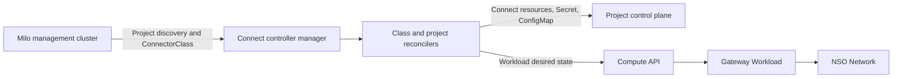
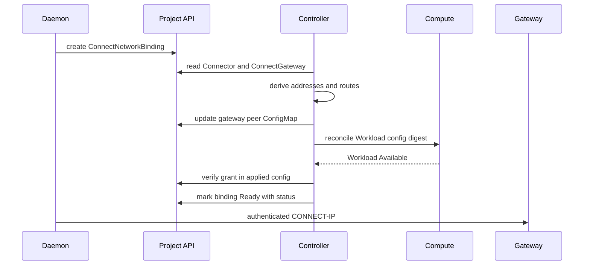

# Controller Architecture

The Connect controller is a Milo multicluster controller that validates
Connect-owned project resources and reconciles managed CONNECT-IP gateways. It
does not proxy application or packet traffic.

## Overview

**Key characteristics:**

- **Multicluster**: watches Project control planes discovered through Milo.
- **Declarative**: status conditions describe validation and convergence.
- **Deterministic**: stable child names, gateway identity, and peer addresses.
- **Least privilege**: controller deployment is non-root; only the gateway
  Workload receives the networking capabilities needed for TUN forwarding.
- **Eventually consistent**: periodic requeues cover Lease expiry and external
  Workload/config convergence.

## Architecture Diagram

## Reconciler Set

### ConnectorClass

Validates the platform-supported transport and capabilities. The current API
permits `masque-v1` and named TCP, UDP, or IP capabilities. Enrollment requires
exactly one Ready class that advertises `masque-v1`.

### Connector

Validates the 32-byte hex public key, resolves the class from the management
cluster, creates a deterministic 30-second Lease, and publishes Accepted and
Ready conditions. Ready depends on Lease renewal by the enrolled agent.

### ConnectorAdvertisement

Requires a Ready Connector and valid TCP/UDP ports. It represents discovery
metadata; the controller never opens the local service or proxies its bytes.

### ConnectGateway

Validates routes, image, relay URLs, network, and location. It reconciles a
stable private-key Secret, peer-grant ConfigMap, and one-replica Compute
Workload. Status exposes the public endpoint ID and Workload reference only.

### ConnectNetworkBinding

Validates same-project Connector and gateway references, derives deterministic
client/gateway IPv6 `/128`s, contributes an exact peer grant, and reports the
endpoint, addresses, routes, and relays consumed by the daemon. Ready requires
the current gateway Workload to have the grant applied.

## Gateway Workload

The generated Workload runs the configured `iroh-gateway` image with:

- one interface on the requested VPC Network;
- the gateway identity mounted read-only;
- generated peer configuration from the ConfigMap;
- `NET_ADMIN` and `MKNOD` plus required forwarding sysctls;
- a loopback-only Prometheus listener;
- one replica and a configuration digest that rolls on grant changes.

The controller creates the Workload but not the Workload's NSO NetworkBinding;
Compute owns that attachment. The Network reference remains a name-only
cross-service reference.

## Binding Reconciliation Flow

## Deployment

The manager uses leader election. Metrics bind to port 8080 and probes to 8081.
The container runs as UID/GID 65532 with a read-only root filesystem, Runtime
Default seccomp profile, and no Linux capabilities. Its credentials must read
Milo discovery resources and reconcile the defined resources in project
control planes.

## Failure Semantics

- Invalid specs produce conditions rather than partial child resources.
- Lease expiry removes Connector readiness without forcing a disruptive gateway
  rollout for every peer.
- Route count, grant convergence, and Workload readiness are explicit binding
  failure reasons.
- Gateway Ready means Workload availability, not an end-to-end packet probe.
- Deleting a binding removes its grant on the next reconciliation.

## External References

- [Managed VPC Attachment](../architecture/managed-vpc-attachment.md)
- [Resource Model](../architecture/resource-model.md)
- [Connect API and controller guide](../../connect-controller/README.md)
