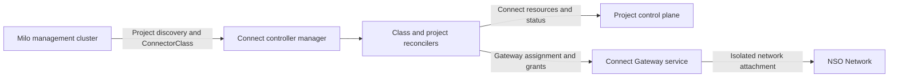
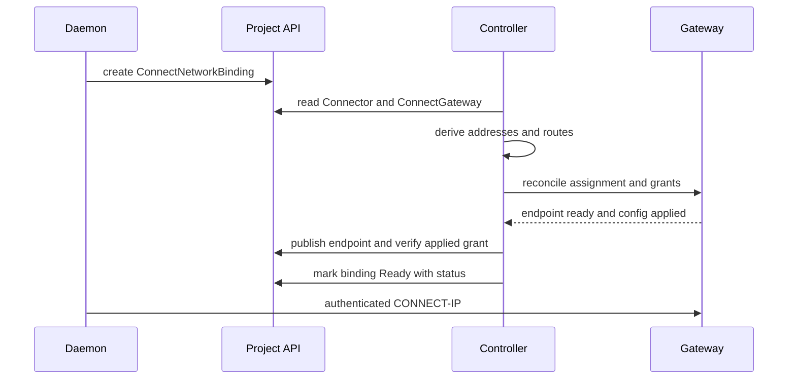

# Controller Architecture

The Connect controller is a Milo multicluster controller that validates
Connect-owned project resources and reconciles managed CONNECT-IP gateways. It
does not proxy application or packet traffic.

## Overview

**Key characteristics:**

- **Multicluster**: watches Project control planes discovered through Milo.
- **Declarative**: status conditions describe validation and convergence.
- **Deterministic**: stable child names, gateway identity, and peer addresses.
- **Least privilege**: controller deployment is non-root; privileged packet
  forwarding remains inside the platform gateway data plane.
- **Eventually consistent**: periodic requeues cover Lease expiry and external
  gateway-service configuration convergence.

## Architecture Diagram

## Reconciler Set

### ConnectorClass

Validates the platform-supported transport and capabilities. The current API
permits `masque-v1` and named TCP, UDP, or IP capabilities. Enrollment requires
exactly one Ready class that advertises `masque-v1`.

### Connector

Validates the 32-byte hex public key, resolves the class from the management
cluster, creates a deterministic 30-second Lease, and publishes Accepted and
Ready conditions. Ready depends on Lease renewal by the enrolled agent.

### ConnectorAdvertisement

Requires a Ready Connector and valid TCP/UDP ports. It represents discovery
metadata; the controller never opens the local service or proxies its bytes.

### ConnectGateway

Resolves a ready project-installed `ConnectGatewayClass` and validates routes,
relay policy, network, and placement requirements. Its target contract assigns
the logical gateway to compatible shared or dedicated gateway capacity and
publishes the endpoint, lifecycle phase, idle time, and readiness status. A
`ConnectGateway` does not imply a dedicated runtime instance.

### ConnectNetworkBinding

Validates same-project Connector and gateway references, derives deterministic
client/gateway IPv6 `/128`s, contributes an exact peer grant, and reports the
endpoint, addresses, routes, and relays consumed by the daemon. Ready requires
the assigned gateway service to have the grant applied.

## Gateway Service Assignment

The controller reconciles a logical gateway assignment with:

- an endpoint identity and relay reachability;
- an isolated attachment to the requested VPC Network;
- exact project and Connector grant configuration;
- shared multi-tenant placement by default, or dedicated single-tenant
  placement when requested and available; and
- an applied configuration generation used for readiness.

The runtime topology behind that assignment is not part of the Connect API
contract. The platform can implement an assignment with shared processes,
dedicated capacity, or a different scheduler as long as the endpoint, network
isolation, grants, and readiness contract remain intact. The Network reference
remains a name-only cross-service reference.

## Binding Reconciliation Flow

## Deployment

The manager uses leader election. Metrics bind to port 8080 and probes to 8081.
The container runs as UID/GID 65532 with a read-only root filesystem, Runtime
Default seccomp profile, and no Linux capabilities. Its credentials must read
Milo discovery resources and reconcile the defined resources in project
control planes.

## Failure Semantics

- Invalid specs produce conditions rather than partial child resources.
- Lease expiry removes Connector readiness without forcing a disruptive gateway
  restart for every peer.
- Route count, grant convergence, and gateway-service readiness are explicit
  binding failure reasons.
- Gateway Ready means the assigned endpoint and network attachment are
  available, not that an end-to-end destination probe succeeded.
- Deleting a binding removes its grant on the next reconciliation.

## External References

- [Connect Gateway Architecture](./gateway-architecture.md)
- [Managed VPC Attachment](../architecture/managed-vpc-attachment.md)
- [Resource Model](../architecture/resource-model.md)
- [Connect API and controller guide](../../connect-controller/README.md)
