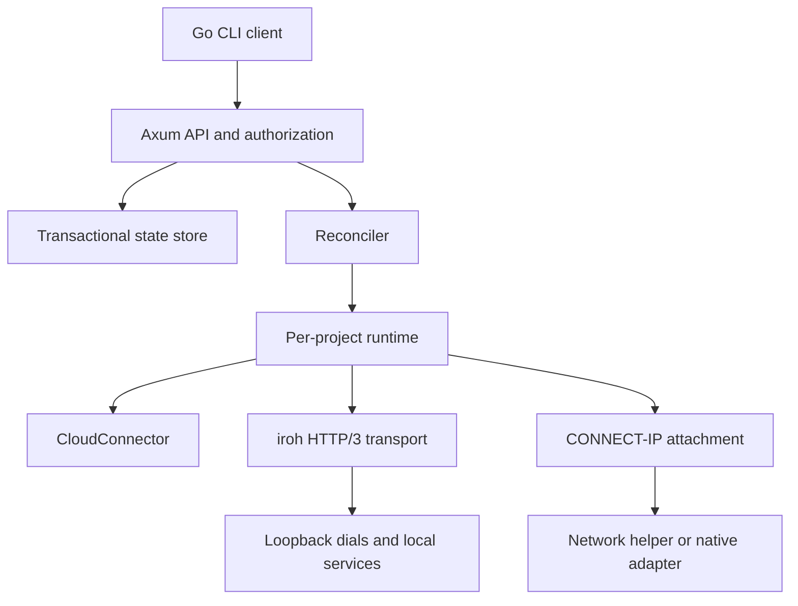
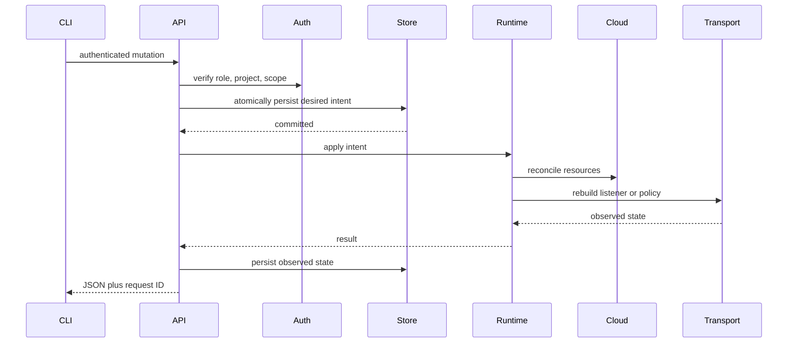

# Daemon Architecture

`datum-connect-daemon` is the local control plane for one host. It owns durable
intent, cloud authorization, Connector identities, peer transports, loopback
listeners, and network attachments. The CLI is a stateless client of this
daemon rather than a second owner of those resources.

## Overview

**Key characteristics:**

- **Loopback-only API**: Axum HTTP server on `127.0.0.1:47780` by default.
- **Token protected**: setup, operate, and viewer roles with project/resource
  scopes.
- **Transactional state**: private, versioned, atomic local persistence.
- **Per-project runtime**: separate cloud client, endpoint, policy, and tasks.
- **Desired-state reconciliation**: services, dials, and managed attachments
  resume after restart.
- **Privilege separation**: optional root helper owns native interfaces while
  the user daemon keeps credentials and Connector keys.

## Architecture Diagram

## Core Components

### HTTP API

The router exposes:

| Endpoint family | Purpose |
| --- | --- |
| `/v1/health`, `/v1/status` | Health and combined desired/observed project status |
| `/v1/up`, `/v1/down` | Enrollment lifecycle |
| `/v1/services` | Create, remove, pause, and resume services |
| `/v1/dials` | Create and remove local forwards |
| `/v1/networks` | Prepare, approve, join, and leave network attachments |
| `/v1/ping` | Probe a Connector endpoint |
| `/v1/tokens` | Mint, list, and revoke delegated daemon tokens |
| `/v1/audit` | Read the bounded local mutation audit trail |

Every request receives an `x-request-id`. The health route is unauthenticated;
project data and mutations require a bearer token. Mutations are serialized so
validation, persistence, and runtime changes cannot interleave unpredictably.

### State Store

The store holds a mutex-protected state snapshot and an exclusive process lock.
Transactions clone the current state, apply validation, persist the complete
replacement, then publish it. Credentials are imported into per-project private
files. Unsupported state versions fail startup rather than being guessed.

### Control Boundary

The `Control` trait separates API intent from its live implementation. It covers
project start/stop, service and dial lifecycle, managed and peer networking,
ping, diagnostics, and shutdown. Tests can substitute an unsupported or fake
control implementation without touching real networking or cloud resources.

### Per-Project Runtime

A running project owns:

- the cloud client and renewable authorization;
- one iroh endpoint and Connector identity;
- an atomic service destination policy;
- live services, local dials, and CONNECT-IP attachments;
- Lease/liveness and policy-refresh tasks;
- a cancellation tree for fail-closed shutdown.

The runtime renews the Connector Lease every 10 seconds and refreshes cloud
authorization, resources, and policy every 30 seconds. If refresh fails, it
marks authorization unavailable, empties service policy, cancels dials and
network attachments, and records the error stage.

### Transport Policy

The daemon rebuilds a complete destination policy from durable services and
current cloud discovery, then swaps it atomically. Each destination identifies
one exact TCP or UDP local target and a set of authenticated peer endpoint IDs.
Sessions invalidated by a policy change are cancelled.

## Request Flow

For a recoverable live failure, desired state remains committed and status
records the observed error. A later periodic or startup reconciliation retries
the same intent.

## Startup and Shutdown

Startup validates protected storage, initializes the setup token, loads state,
constructs the real control runtime, resets stale observed flags, and launches
reconciliation. Projects marked `desired_up` retry transient resume failures
with bounded backoff.

Graceful shutdown stops the HTTP server, cancels project runtimes, closes
listeners and transports, and removes owned interfaces. Helper-backed adapters
also disappear when authenticated IPC closes.

## External References

- [Client Device Architecture](./client-device-architecture.md)
- [Architecture Overview](../architecture/README.md)
- [Enrollment and Reconciliation](../architecture/enrollment-and-reconciliation.md)
- [Daemon operational guide](../../connect-lib/daemon/README.md)
