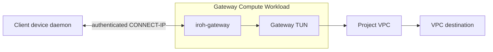
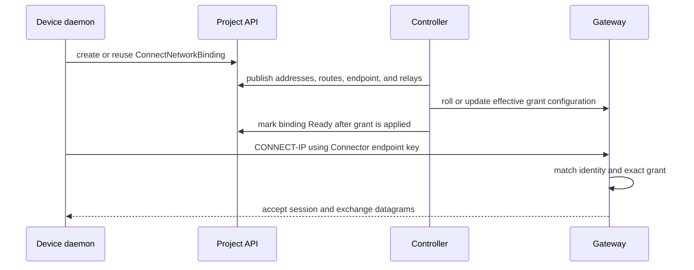

# Managed Gateway Architecture

The managed gateway connects authenticated Connectors to one project VPC. One
`ConnectGateway` resource produces one gateway identity, one grant
configuration, and one `iroh-gateway` process inside a VPC-attached Compute
Workload.

This component is distinct from the separately deployed public-ingress MASQUE
edge. The managed gateway terminates CONNECT-IP for VPC and optional peer
routing; it does not implement the public HTTPProxy control plane.

## Overview

The gateway process is the only Connect-managed cloud component in the packet
path. The Connect controller and project API prepare its identity and grants but
do not proxy sessions or packets.

## Deployment Unit

The controller renders a one-replica Compute Workload from
`ConnectGateway.spec`. The Workload receives:

- a private gateway identity mounted read-only from a project Secret;
- exact Connector peer grants generated in a project ConfigMap;
- configured iroh relay URLs;
- one interface attached by Compute to the requested NSO Network;
- `NET_ADMIN`, `MKNOD`, and the forwarding sysctls needed for its TUN path;
- a configuration digest that rolls the Workload when effective grants change.

Compute owns the Workload's VPC attachment. The Connect controller declares the
Workload but does not create a second NSO NetworkBinding for it.

## Identity and Admission

The gateway has a stable private key stored in the project Secret. Only its
public endpoint ID is published in `ConnectGateway.status` and returned to
clients through binding status.

Each ready `ConnectNetworkBinding` contributes a grant keyed by the Connector's
public endpoint identity. A grant contains the assigned client address, gateway
peer address, MTU, and approved VPC or peer routes. The gateway accepts a session
only when the authenticated endpoint key matches a current grant.

Creating the binding is the project authorization decision. Applying the grant
at the gateway is the data-plane enforcement step. Neither the binding alone nor
possession of a project access token bypasses endpoint authentication.

## Session Establishment

Gateway Ready means that the Compute Workload is available. Binding Ready adds
evidence that the effective Workload configuration contains the Connector's
grant. Neither condition is an end-to-end packet probe of the destination VPC.

## Packet Path

For an admitted session, the gateway:

1. receives one complete IP packet in a QUIC DATAGRAM;
2. validates its address, route, MTU, and packet policy against the grant;
3. injects the approved packet into the gateway TUN;
4. relies on worker forwarding and optional NAT or return routes to reach the
   project VPC;
5. validates return traffic and sends it to the client in the reverse direction.

The gateway does not fragment an oversized packet or fall back to a reliable
stream. The complete packet must fit the negotiated datagram capacity.

Gateway operators remain responsible for VPC firewall policy, destination
service policy, and either source NAT or a correct return route. Connect does
not globally enable forwarding or alter the VPC's policy model.

## Peer Routing

`ConnectGateway.spec.peerRouting` is disabled by default. When enabled, the
controller adds other ready bindings' assigned `/128` addresses to each peer
grant. The gateway can then forward traffic directly between authenticated
sessions without entering the VPC or its NAT path.

Peer routing remains bounded by the 32-route limit and each client's assigned
source address. It does not turn the gateway into an arbitrary site-to-site
router.

## Reconfiguration

Binding creation, deletion, and readiness changes alter the generated grant
configuration. The controller computes a configuration digest for the Workload
and waits for the current configuration to be applied before reporting the
binding Ready.

Temporary Connector Lease expiry prevents new readiness but does not
automatically restart the shared gateway and disrupt every established peer.
Deleting a binding removes its grant during reconciliation. A client whose
local helper approval no longer matches new binding status must receive explicit
administrator approval before reconnecting.

## Observability

The gateway exposes Prometheus metrics on `127.0.0.1:9090` inside the Workload.
The controller does not expose that listener on the VPC interface. Metrics and
structured logs cover:

- active, opened, and closed CONNECT-IP sessions;
- QUIC datagrams and transport errors;
- packets and bytes injected into and returned from the TUN;
- policy drops by reason;
- effective datagram capacity and MTU errors;
- optional egress-NAT rule counters.

Gateway and client logs share a `session_id`. Optional OpenTelemetry propagation
continues the client setup trace at the gateway without creating a span for each
packet.

## Failure Boundaries

| Failure | Gateway behavior |
| --- | --- |
| Unknown or revoked Connector key | Reject the session |
| Grant/configuration not yet applied | Keep the binding not Ready and reject admission |
| Packet violates address or route policy | Drop and count the packet without broadening access |
| Datagram capacity below approved MTU | Fail the session rather than fragment or reduce policy |
| Workload unavailable | Gateway reports not Ready; clients cannot attach |
| VPC route, firewall, or destination failure | Session may remain up; packet counters identify the failing segment |

## Current Boundaries

- Managed bindings currently use IPv6 client and gateway `/128` addresses.
- One attachment does not provide dual-stack overlay networking.
- IPv6 extension headers and fragments are unsupported.
- The Network reference is a name-only cross-service reference.
- Gateway identity rotation and full replacement semantics are not yet
  production-ready.
- Native gateway-to-instance forwarding still requires validation for each
  supported target environment.

## Related Documentation

- [Deployment Topology](../architecture/deployment-topology.md)
- [Managed VPC Attachment](../architecture/managed-vpc-attachment.md)
- [CONNECT-IP Data Plane](../architecture/connect-ip-data-plane.md)
- [Controller Architecture](./controller-architecture.md)
- [Observability](../architecture/observability.md)
- [Connect API and controller guide](../../connect-controller/README.md)
