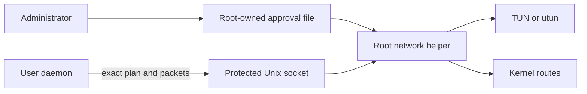

# Network Helper Architecture

The networking helper is a narrow local privilege boundary for CONNECT-IP. It
allows an unprivileged user daemon to retain cloud credentials and Connector
keys while a root service owns only pre-approved interfaces, routes, and packet
I/O.

## Overview

**Key characteristics:**

- no cloud credentials, API client, or Connector private key;
- root-owned, private approval configuration;
- daemon authentication with Unix peer credentials;
- exact-match interface, address, peer, MTU, and route approval;
- framed packet IPC rather than commands or shell execution;
- adapter lifetime bound to the authenticated IPC session.

## Trust Boundary

The administrator approves a finite plan. The daemon may activate that plan but
cannot extend it. The helper validates the requesting UID, configuration path
ownership, and every plan before changing networking.

On Linux, Connect keeps approval state and the Unix socket in
`/var/lib/datum-connect-network-<uid>` and installs the helper executable in
`/usr/libexec/datum-connect/<uid>`. The executable must not live in `/var/lib`:
SELinux labels that directory as state, not executable code. When SELinux is
enabled, installation runs `restorecon` on the helper path so the system policy
assigns its expected executable label. If `restorecon` is unavailable or fails,
Connect stops installation and reports the policy setup error.

## Approval Model

One approval fixes:

- interface name or label;
- assigned host address and remote peer address;
- MTU between 1280 and 1500;
- installed routes;
- any explicitly advertised router prefixes.

Default routes, overlapping active routes, unapproved addresses, and plan
changes are rejected. A managed binding whose status changes therefore requires
explicit `--replace-helper-approval`; cloud state alone cannot expand root
network authority.

## IPC and Packet Enforcement

The helper accepts only the configured user daemon over a protected Unix socket.
Messages are length-bounded and describe an approved interface operation or an
IP packet. There is no endpoint for arbitrary commands, files, sysctls,
firewalls, or route mutation.

The helper validates packet source and destination against the plan. Direct-
peer mode also applies the daemon's explicit transport rules. Concurrent
clients and active routes are bounded, preventing a second session from
silently taking over an interface or prefix.

## Adapter Lifecycle

The helper creates a new nonpersistent TUN/utun and exact routes. It never
adopts an existing adapter. When IPC closes, approval is revoked, or the daemon
cancels the attachment, it closes the descriptor and removes only networking it
created.

Windows uses a protected LocalSystem daemon and Wintun rather than the Unix
helper IPC model. The same adapter library rejects existing adapters/routes,
pins the official driver, and validates protected ACLs and reparse-point rules.

## Failure Behavior

| Failure | Result |
| --- | --- |
| Approval missing or different | `approval_required`; no interface created |
| Wrong daemon UID | IPC rejected |
| Unsafe approval path or permissions | Helper startup fails |
| Route overlaps an active attachment | New attachment rejected |
| IPC disconnects | Owned adapter and routes are removed |
| Packet violates address policy | Packet is dropped and counted |

## External References

- [CONNECT-IP Data Plane](../architecture/connect-ip-data-plane.md)
- [Identity and Authorization](../architecture/identity-and-authorization.md)
- [Daemon operational guide](../../connect-lib/daemon/README.md)
